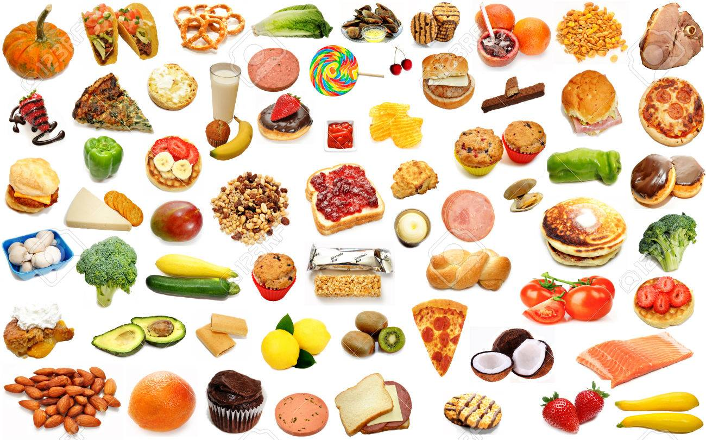

## SECTION 1 : IRS-PM-ISY5001-2020-01-18-GROUP5-A.I.-Food-Recommender
## Food Recommendation

---  

## SECTION 2 : EXECUTIVE SUMMARY / PAPER ABSTRACT

In developed countries, obesity level has been increasing rapidly and people look for ways to effectively lose weight. People are increasingly aware that Diet plays the major part of people’s health and especially in their effort to maintain healthy body weight. Many publications estimate that the impact of diet is about 75% to 80% as compared to exercise which accounts for 20% to 25% when it come to weight loss.

We need to acknowledge that each individual is unique, people want to have options in choosing diet style that is most suitable for them (lifestyle, type of food, belief, etc). Each diet style has its own rule which can be confusing. Therefore people need easy guidance and idea on the selection of food based on their diet style and their food preference based on their belief/values (i.e. religion, vegetarian, vegan, etc)

The above is the background why our team chose this area as our project. Simply saying, food is very dear to our daily life. At the same time we saw that we could apply what we have learned in this semester:
- Machine Reasoning: applying rule-based for each variety of diet style
- Optimisation technique to ensure our search results in the most optimum food choice based on the selected diet style
- Knowledge Discovery with Data Mining: classify food based on keywords to ensure food selection for various type of diets is proper

---

## SECTION 3 : CREDITS / PROJECT CONTRIBUTION

| Official Full Name  | Student ID (MTech Applicable)  | Work Items (Who Did What) | Email (Optional) |
| :------------ |:---------------:| :-----| :-----|
| Mok Kay Yong | A0214617J | Second technical lead + Developing the front end user interface + data mining and food classifications. | e0529481@u.nus.edu |
| Chong Keng Han | A0213547H | Acquires the food database data + prototype development + the creator of the project video animation| e0508648@u.nus.edu |
| Ly Duy Khang (Ken) | A0032571N | Project and technical lead + Setup and plan the technology components | k.ly@u.nus.edu |
| Harry| A0213530X | Research on the diet topic + Prototype development + Main writer for project documentation| e0508631@u.nus.edu |

---

## SECTION 4 : VIDEO OF SYSTEM MODELLING & USE CASE DEMO
`Please refer to the video at Github Folder: Video`

`<Folder Link>` : <https://github.com/ISS-IS02PT/IRS-PM-ISY5001-2020-01-18-GROUP5-A.I.-Food-Recommender/tree/master/Video>

---

## SECTION 5 : USER GUIDE
`Please refer to the User guide at Github Folder: UserGuide`
- System Requirements and Dependencies
- Steps on Backend and Frontend deployment
- Steps on running of the system demo

`<Folder Link>` : <https://github.com/ISS-IS02PT/IRS-PM-ISY5001-2020-01-18-GROUP5-A.I.-Food-Recommender/tree/master/UserGuide>

---
## SECTION 6 : PROJECT REPORT / PAPER
`Please refer to Project report at Github Folder: ProjectReport`

`<File Link>` : <https://github.com/ISS-IS02PT/IRS-PM-ISY5001-2020-01-18-GROUP5-A.I.-Food-Recommender/tree/master/ProjectReport>

---
## SECTION 7 : MISCELLANEOUS
`Please refer to the Jupyter Notebook 'Food_Data_EDA.ipynb' for data analysis at Github Folder: Miscellaneous`

`<File Link>` : <https://github.com/ISS-IS02PT/IRS-PM-ISY5001-2020-01-18-GROUP5-A.I.-Food-Recommender/tree/master/Miscellaneous>

---

**The [Machine Reasoning (MR)](https://www.iss.nus.edu.sg/executive-education/course/detail/machine-reasoning "Machine Reasoning"), [Reasoning Systems (RS)](https://www.iss.nus.edu.sg/executive-education/course/detail/reasoning-systems "Reasoning Systems") and [Cognitive Systems (CGS)](https://www.iss.nus.edu.sg/executive-education/course/detail/cognitive-systems-sf "Cognitive Systems") courses are part of the [Master of Technology in Intelligent Systems](https://www.iss.nus.edu.sg/stackable-certificate-programmes/intelligent-systems "Intelligent Reasoning Systems") offered by [NUS-ISS](https://www.iss.nus.edu.sg "Institute of Systems Science, National University of Singapore").**